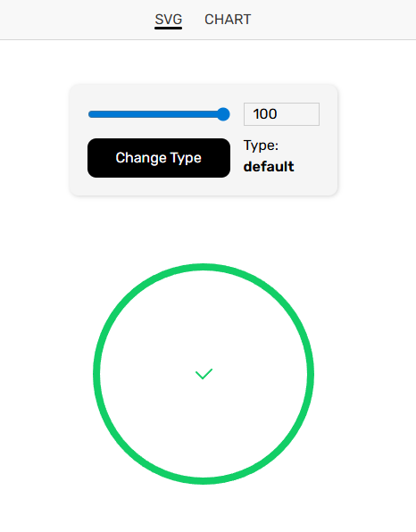
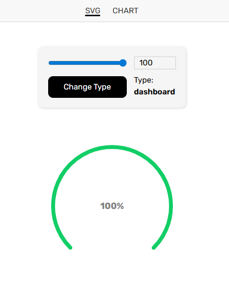
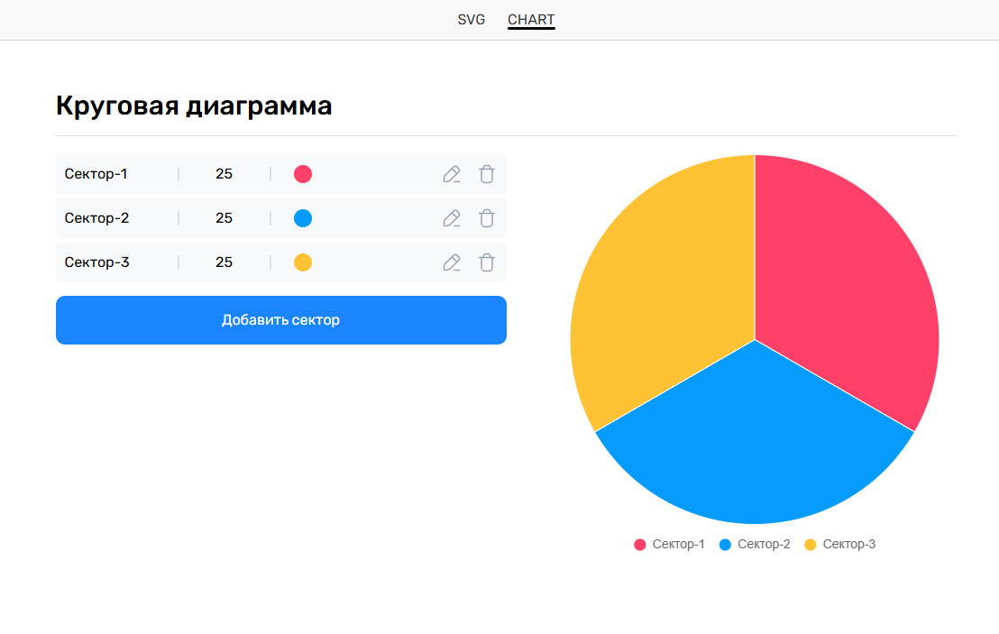

# 📊 Vue Svg/Chart

[](https://vuejs.org/)
[](https://router.vuejs.org/)
[](https://www.chartjs.org/)
[](https://vuetifyjs.com/)
[](https://vitejs.dev/)

Проект, демонстрирует два типа визуализации:

1. **SVG - progress bar/dashboard** - отрисовка элементов с помощью чистого SVG
2. **Chart** - представление данных в виде круговой диаграммы

| Svg Progress Bar                                     | Svg Dashboard                                   | Chart                           |
| ---------------------------------------------------- | ----------------------------------------------- | ------------------------------- |
|  |  |  |

## 🌟 Основные возможности

### SVG

- 🖼️ Использование SVG для стилизации и функционала
- 🔁 Смена типа progressbar/dashboard
- ✨ Плавные анимации при обновлении данных

### CHART

- 🟠 Круговая диаграмма на основе данных
- 🎨 Настраиваемые цвета и значения
- ⚡ Реактивное обновление

## 🛠 Технологии

- [Vue 3](https://vuejs.org/) - Фреймворк
- [Vue Router](https://router.vuejs.org/) - Навигация
- [Chart.js](https://www.chartjs.org/) - Визуализация данных
- [Vuetify](https://vuetifyjs.com/) - Color Picker
- [Vite](https://vitejs.dev/) - Сборка проекта

## 🚀 Быстрый старт

```bash
git clone https://github.com/huTT4/vue-svg-chart.git

cd vue-svg-chart

npm install

npm run dev
```
